[[Pagina Principal]](Home.md)
[[Guia de Utilização]](guia_util.md)

# <h1 style="text-align: center;">Guia de Utilização</h1>

# Indíce
1. [Login](#Login)
2. [Registar](#Registar)
   1. [Clientes](##Clientes)
   2. [Veículos](##Veiculos)
   3. [Condutores](##Condutores)
3. [Reservar](#Reservar)
4. [Devolver](#Devolver)

# Login 
1. Inserir o seu email de funcionário.
2. Inserir a sua respetiva password.
3. Clicar em "LOGIN".
 
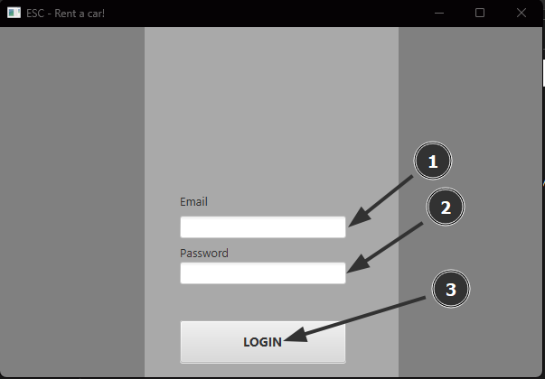

# Registar 
## Clientes 
1. Clicar em "Registo".
2. Clicar em "Clientes".
 
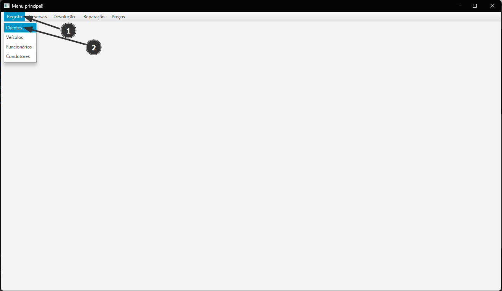
3. Inserir Clientes.
   1. Selecionar um Cliente qualquer (para inserir um cliente) ou Empresa qualquer (para inserir uma empresa) já existente.
   2. Clicar em "Inserir".
   3. Escrever o nome da Empresa ou Cliente.
   4. Escrever a morada.
   5. Escrever o NIF.
   6. Escrever o valor em conta.
   7. Clicar em "Confirmar".
 
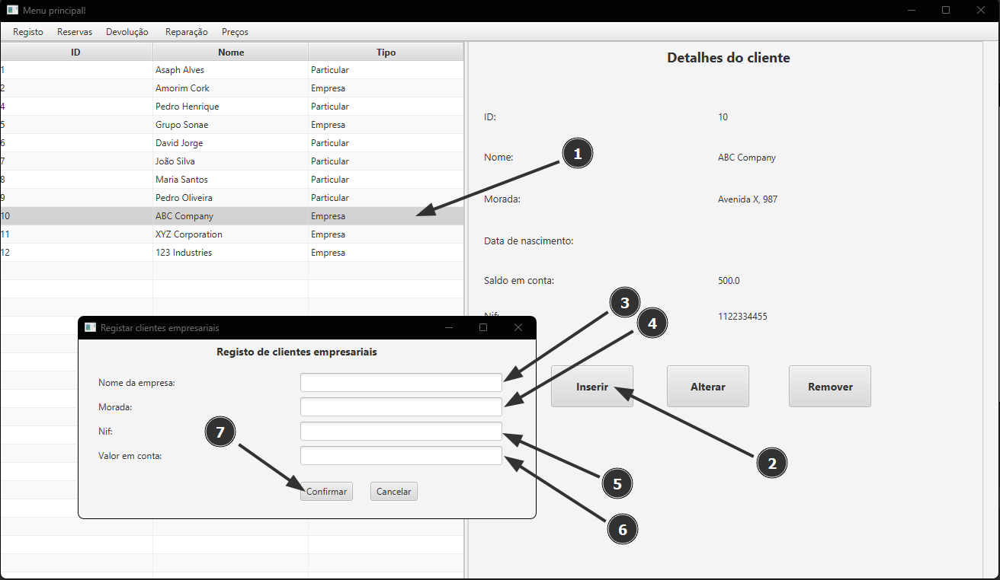

## Veículos 
1. Clicar em "Registo".
2. Clicar em "Veículos".
 
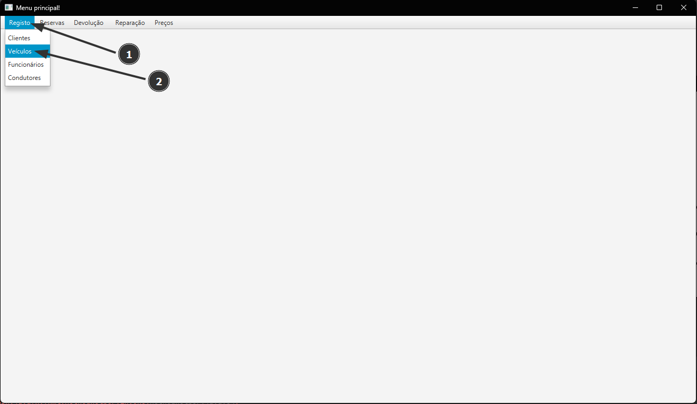
3. Inserir Veículos.
   1. Clicar em "Inserir".
   2. Escrever a Matícula com o formato XX-XX-XX.
   3. Selecionar a "Marca".
   4. Selecionar o "Modelo".
   5. Escrever a Cor.
   6. Escrever o ano de fabricação.
   7. Escrever o número de lugares
   8. Escrever o Preço diário.
   9. Clicar em "Confirmar"
 
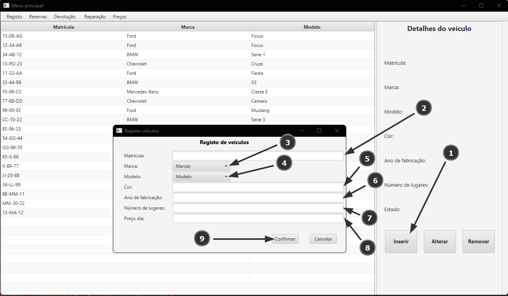

## Condutores
1. Clicar em "Registo".
2. Clicar em "Condutores".
 
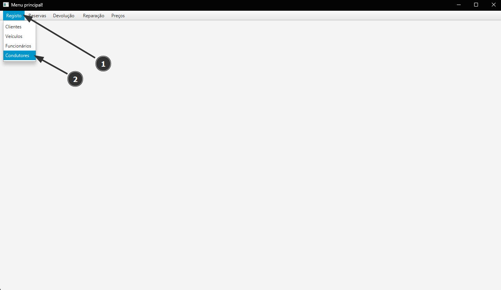
3. Inserir Condutores.
   1. Clicar em "Inserir".
   2. Escrever nome.
   3. Escrever morada.
   4. Escrever número do documento (Cartão de Cidadão/Passa-Porte).
   5. Escrever número da carta de condução.
   6. Escrever a data da emissão da carta (DIA/MES/ANO, exemplo:01/11/2015).
   7. Escrever a data de nascimento (DIA/MES/ANO, exemplo:05/09/1987).
   8. Clicar em "Confirmar".
 

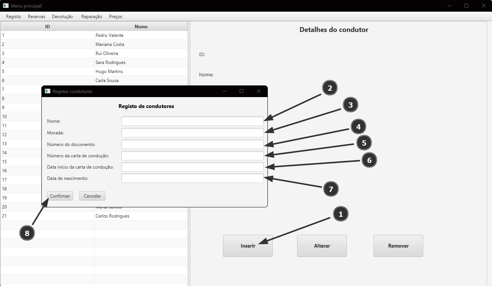

# Reservar 
1. Clicar em "Revervas".
2. Clicar em "Veículos"
 
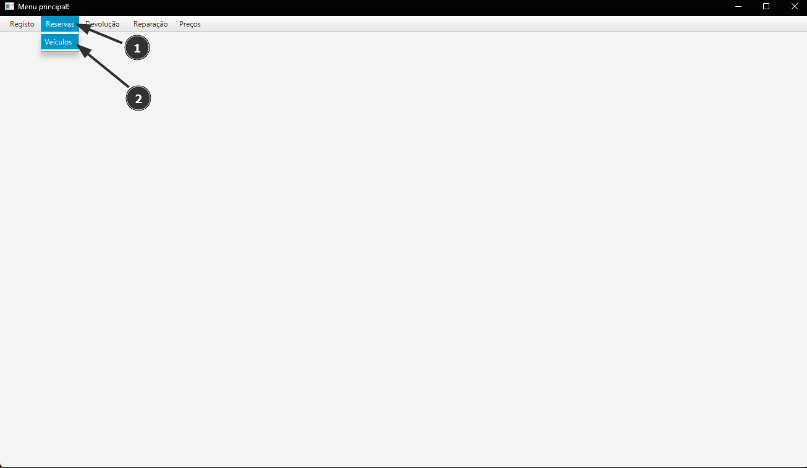
3. Reservar.
   1. Escolher a data de aluguer.
   2. Selecionar o veículo.
   3. Escrever o local de entrega.
   4. Escolher a data de devolução.
   5. Selecionar o Cliente.
   6. Selecionar o Condutor.
   7. Selecionar o tipo de seguro.
   8. Escrever o valor a pagar pelos serviços.
   9. Clicar em "Alugar".
 

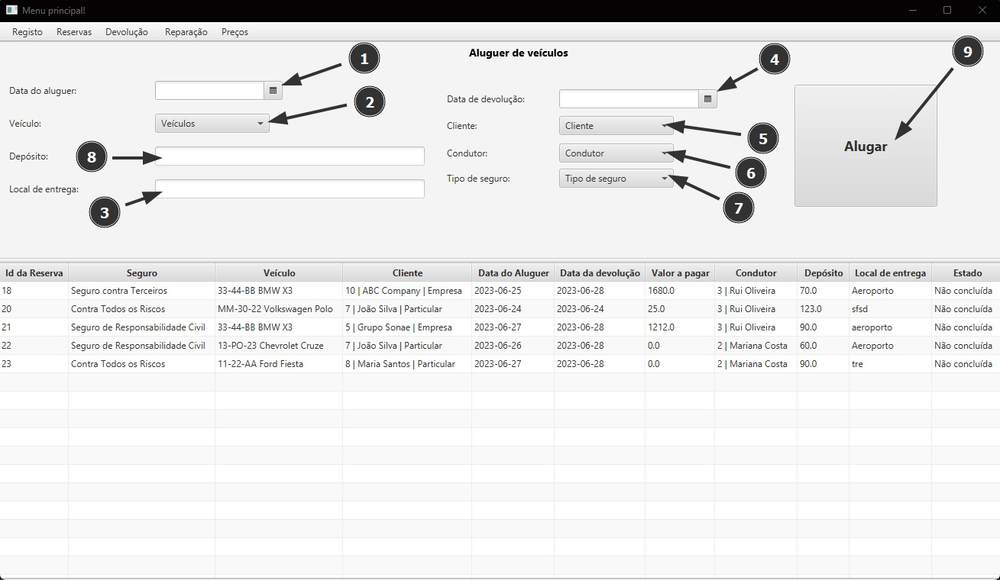

# Devolver 
1. Clicar em "Devolução".
2. Clicar em "Veículo".
 
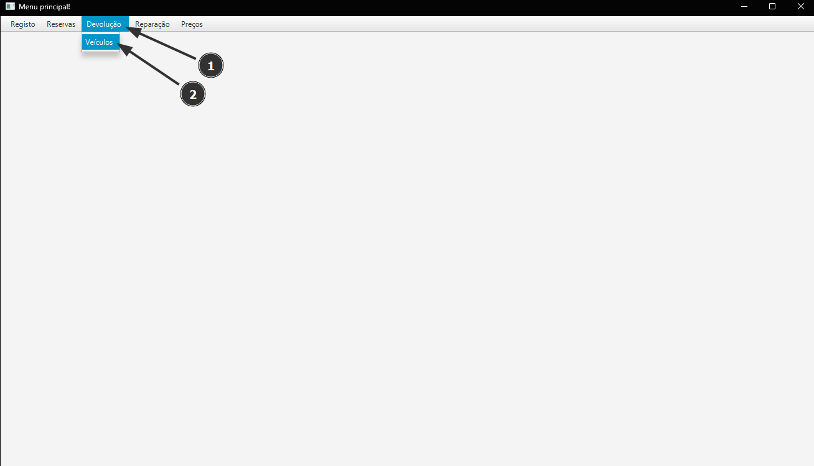
3. Devolver.
   1. Clicar no Veículo que quer que seja devolvido.
   2. Escolher a data de devolução.
   3. Escrever o valor de reparação (0 se não existir nenhum valor de reparação).
   4. Escrever o valor dos custos adicionais (0 se não existirem custos adicionais).
   5. Clicar em "Devolver".
 
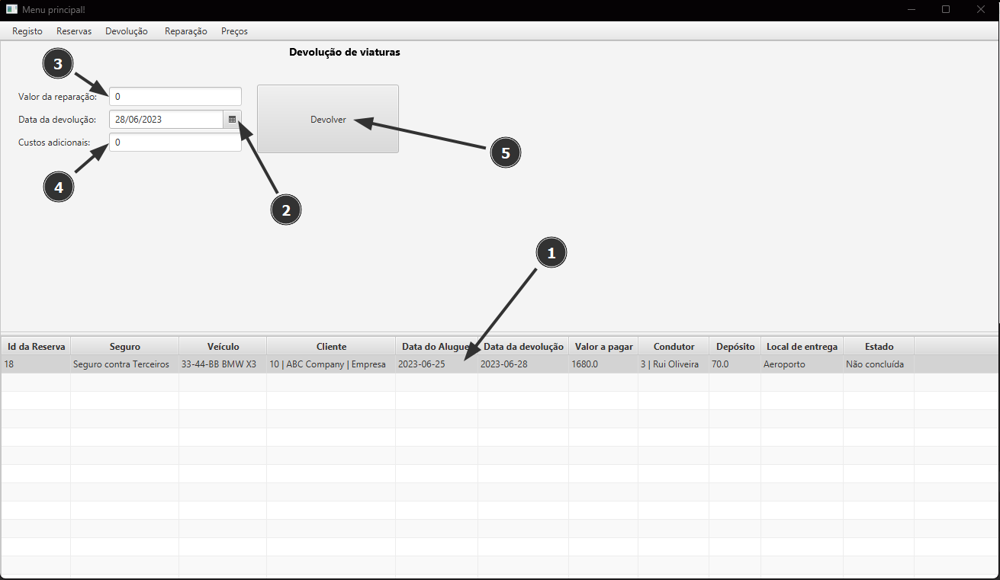
 

[[Pagina Principal]](Home.md)
[[Guia de Utilização]](guia_util.md)